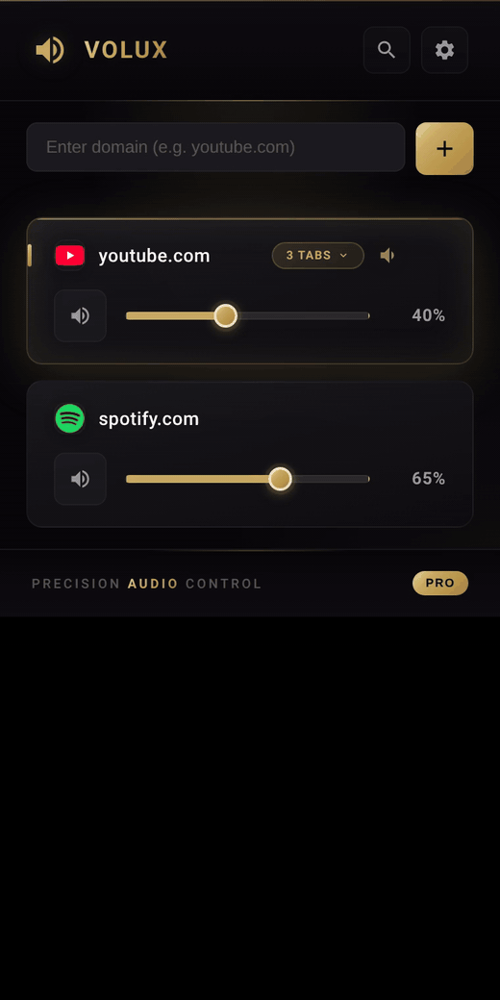

# Volux - Premium Tab Volume Controller

**Precision audio control for every browser tab.**

Volux gives you independent volume control for each website you visit. Stop juggling your system volume - control audio exactly where you need it.

## Demo

Expand the "N tabs" badge on any managed domain (Pro), then drag each tab's slider independently. Three YouTube tabs, three volumes. The site default still covers any tab you haven't customized. Sound-on version: [`marketing/generated/demo-per-tab.mp4`](marketing/generated/demo-per-tab.mp4).

## Features

- **Per-Domain Volume Control** - Set unique volume levels for each website. Your settings persist across sessions.
- **Per-Tab Volume Override (Pro)** - Give individual tabs of the same site their own volume. Works on any site with audio — YouTube, TikTok, Facebook, Spotify, Twitch, SoundCloud, news sites, anywhere. The site default still applies to any tab you haven't customized, and overrides clear automatically when a tab closes or navigates to a different site.
- **Smart Domain Grouping** - By default, all tabs from the same domain share one volume slider. Open 10 tabs on the same site? One control manages them all (and Pro lets you peel off individual tabs when you want them louder or quieter).
- **Instant Mute** - One-click mute for any site without losing your volume setting.
- **Live Audio Detection** - See which tabs are playing audio in real-time with the audio indicator.
- **Lightweight & Fast** - No bloat. Minimal permissions. Instant response.
- **Cross-Browser** - Works on Chrome, Edge, Brave, and Firefox.

## Use Cases

- Keep background music at 30% while your video calls stay at 100%
- Mute distracting auto-play videos without touching your main audio
- Balance audio levels across multiple streaming services
- Control podcast volume independently from notification sounds

## Technical Details

- Built with vanilla JavaScript - no frameworks, no dependencies
- Uses the Web Audio API for precise volume control
- Manifest V3 compliant for Chrome/Edge
- Manifest V2 for Firefox compatibility
- Persistent settings via Chrome Storage API

## Permissions Explained

| Permission | Why It's Needed |
|------------|-----------------|
| `tabs` | To list open tabs and detect which sites are playing audio |
| `storage` | To save your volume settings |
| `scripting` | To inject the volume controller into web pages |
| `<all_urls>` | To control audio on any website you visit |

## Installation

### Chrome Web Store (Recommended)

**[Install from Chrome Web Store](https://chromewebstore.google.com/detail/cnagfimhcaplopdllnmkhalkeagmeapm)**

Works on Chrome, Edge, Brave, and other Chromium-based browsers.

### Firefox Add-ons
**[Install from Firefox Add-ons](https://addons.mozilla.org/en-US/firefox/addon/volux-premium-volume-control/)**

### Manual Installation (Development)
1. Download the latest release
2. Open `chrome://extensions`
3. Enable "Developer mode"
4. Click "Load unpacked" and select the extension folder

## Privacy

Volux does not collect, store, or transmit any user data. All settings are stored locally on your device. No analytics. No tracking. No servers.

## Support

For issues and feature requests, please open an issue on GitHub.

## License

MIT License - See LICENSE file for details.

---

**Volux** - Precision Audio Control
